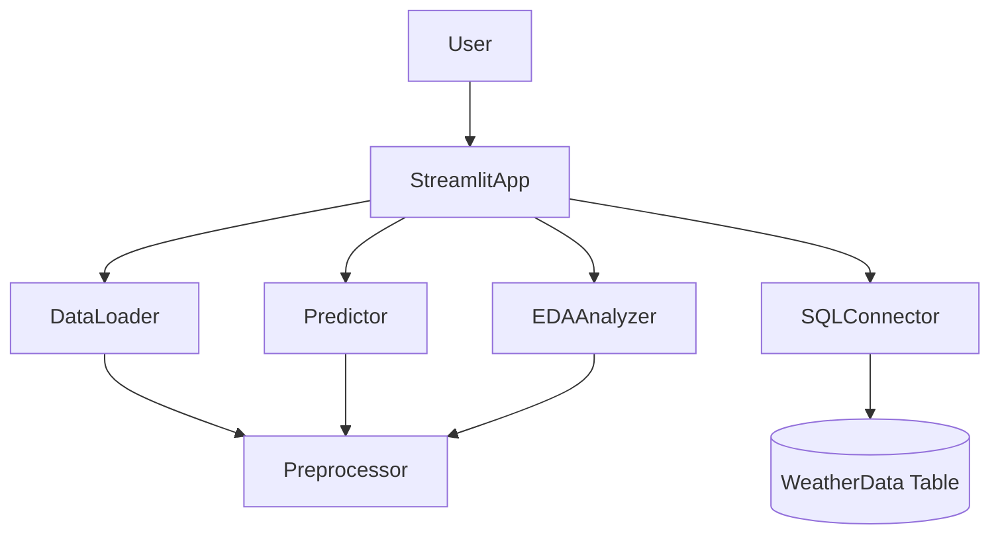

# Weather Forecasting System

The **Weather Forecasting System** predicts weather parameters such as **temperature, humidity, and wind speed**. It combines **machine learning**, **interactive dashboards**, and **database integration** for an end-to-end weather forecasting solution.

---

## Table of Contents

1. [Project Structure](#project-structure)
2. [Features](#features)
3. [Setup Instructions](#setup-instructions)
4. [Usage](#usage)
5. [Future Enhancements](#future-enhancements)
6. [UML Diagrams](#uml-diagrams)
7. [References](#references)
8. [Conclusion](#conclusion)
9. [What You Gain](#what-you-gain-from-this-project)

---

## Project Structure (Visual)

```
Weather Forecasting System/
├─ app.py                       # Streamlit app entrypoint
├─ data_loading.py              # Load CSV data
├─ data_preprocessing.py        # Preprocess raw data
├─ db.sql                       # SQL Server schema
├─ eda.py                       # Generate EDA plots
├─ eda_plots/                   # Saved interactive PNG plots
├─ models/                      # Trained model files & metadata
│   ├─ adaptive_drop_patch_model.pth
│   └─ adaptive_drop_patch_model.json
├─ models_trainings/            # ML training scripts
│   ├─ __init__.py
│   ├─ config.py
│   ├─ dataset.py
│   ├─ forecast_cli.py
│   ├─ plot_app.py
│   ├─ test_import.py
│   ├─ train_model.py
│   └─ transformer.py
├─ requirements.txt             # Python dependencies
├─ sql_connection.py            # SQL Server helpers
├─ test.py                      # Misc tests
└─ weatherHistory.csv           # Historical weather dataset
```

---

## Features Flow Diagram



**Explanation:**

* **User** interacts with the **StreamlitApp**.
* **DataLoader** loads raw CSV data and passes it to **Preprocessor**.
* **EDAAnalyzer** uses preprocessed data to generate interactive plots.
* **Predictor** uses **AdaptiveDropPatch Transformer** for forecasting.
* **SQLConnector** interacts with **WeatherData** table in SQL Server.

---

## Features

1. **Transformer-Based Forecasting**

   * Custom **AdaptiveDropPatch Transformer** for multi-step forecasting.
   * Supports temperature, humidity, wind speed predictions.
   * Save/load models with metadata.

2. **Interactive EDA**

   * Histograms, correlation heatmaps, trend lines.
   * Interactive Plotly charts embedded in Streamlit.
   * Saved as PNGs in `eda_plots/`.

3. **SQL Server Integration**

   * Connect and query **WeatherData** table.
   * Supports scalable storage for predictions.

4. **Modular Design**

   * Separate modules for **data loading, preprocessing, modeling, visualization, and database** operations.

---

## Setup Instructions

### Prerequisites

* **Python 3.8+**
* **MS SQL Server + SSMS** (optional)
* **Dataset:** `weatherHistory.csv`

### Installation

1. Clone the repository:

```bash
git clone https://github.com/your-username/Weather-Forecasting-System.git
cd Weather-Forecasting-System
```

2. Install dependencies:

```bash
pip install -r requirements.txt
```

3. (Linux Only) Install system libraries:

```bash
sudo apt install -y libgl1-mesa-glx
```

4. Run the Streamlit app:

```bash
streamlit run app.py
```

---

## Usage

### Home

* Overview and instructions.

### Train Model

* Configure parameters: target variables, epochs, batch size, learning rate.
* Train **AdaptiveDropPatch Transformer**.
* Saved in `models/`.

### Forecasting

* Load pre-trained models.
* Select forecast horizon & target features.
* Display interactive Plotly charts.

### Database Access

* Connect to SQL Server.
* View `WeatherData` table content.

### EDA

* Generate interactive visualizations.
* Manage cached plots in `eda_plots/`.

---

## Future Enhancements

* Ensemble Models: LSTM, XGBoost integration.
* Geo-Spatial Predictions with Maps.
* Docker Containerization.
* User Authentication for personalized features.
* Support for PostgreSQL, SQLite databases.

---

## UML Diagrams

### Database UML (WeatherData Table)

| Attribute           | Type  | Description            |
| ------------------- | ----- | ---------------------- |
| ID                  | int   | Primary key            |
| Temperature         | float | Measured temperature   |
| ApparentTemperature | float | Feels-like temperature |
| Humidity            | float | Relative humidity      |
| WindSpeed           | float | Wind speed             |
| WindBearing         | float | Wind direction         |
| Visibility          | float | Visibility distance    |
| Pressure            | float | Atmospheric pressure   |
| IsRainy             | bool  | Rain indicator         |
| Hour, Day, Month    | int   | Temporal components    |

### Application UML (PlantUML)

```plantuml
@startuml
class DataLoader { +load_data(file) +read_csv() }
class Preprocessor { +preprocess_data(df) +clean_missing_values() }
class EDAAnalyzer { +perform_eda(df) +generate_plots() +get_data_info(df) }
class Predictor { -model -meta +load_model(path) +forecast(data) }
class StreamlitApp { -current_page -session_state +run_app() +show_forecasting() +show_eda() +show_database_access() }
class SQLConnector { +connect(server, db, user, pw) +retrieve_data() +insert_data() }

StreamlitApp --> DataLoader
StreamlitApp --> Preprocessor
StreamlitApp --> EDAAnalyzer
StreamlitApp --> Predictor
StreamlitApp --> SQLConnector
Predictor --> Preprocessor
@enduml
```

---

## References

* [Streamlit Documentation](https://docs.streamlit.io/)
* [pyodbc Documentation](https://github.com/mkleehammer/pyodbc)
* [SQLAlchemy Documentation](https://www.sqlalchemy.org/)
* [Scikit-learn Documentation](https://scikit-learn.org/)
* [Plotly Documentation](https://plotly.com/python/)
* Transformer Models Research Papers

---

## Conclusion

The system integrates:

* Transformer-based forecasting
* Interactive dashboards (Streamlit + Plotly)
* SQL Server integration
* Modular, scalable code

It provides an **end-to-end weather prediction solution** for data scientists and domain experts.

---

## What You Gain

* Hands-on transformer model application.
* Data preprocessing & EDA experience.
* SQL database integration.
* Interactive dashboards using Streamlit and Plotly.
* Clean, scalable project structure.


